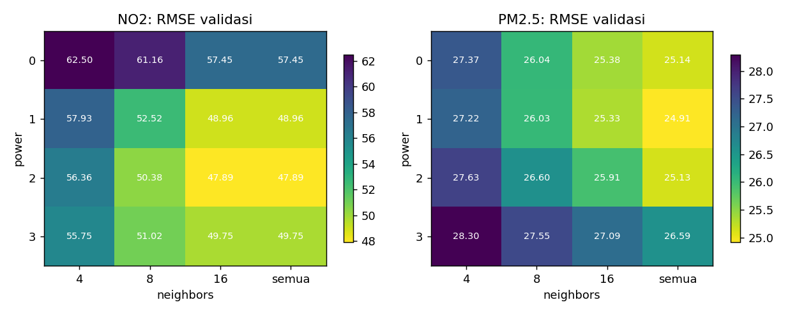
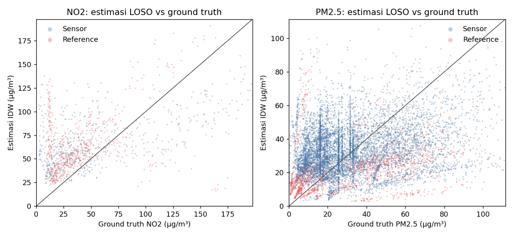
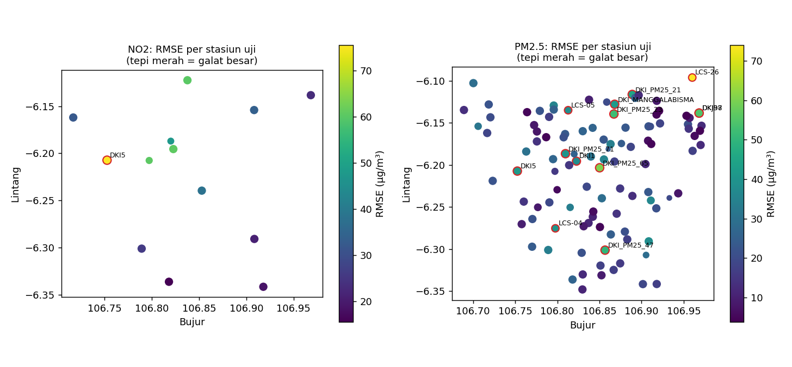
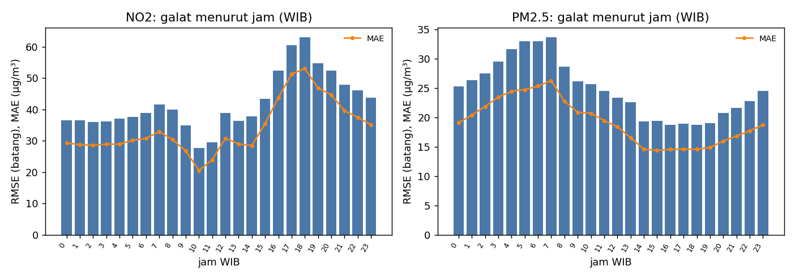
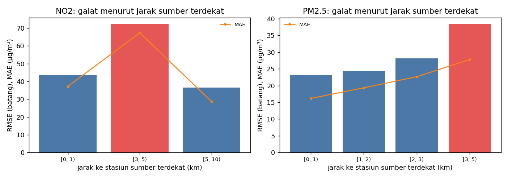
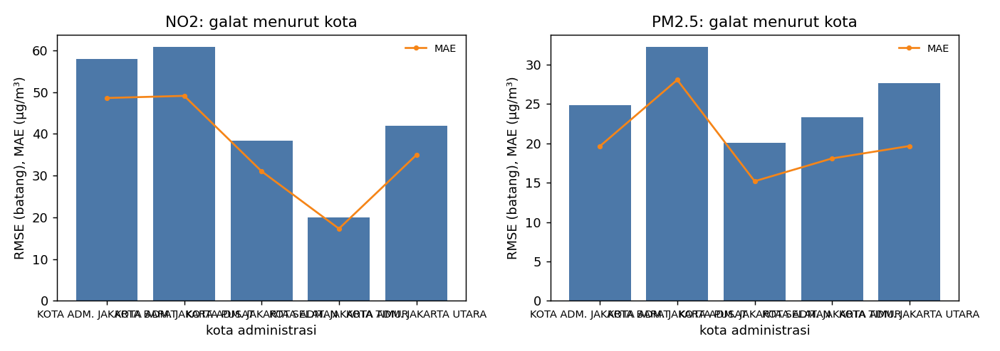
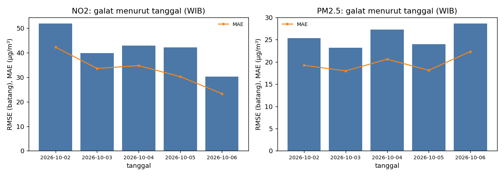
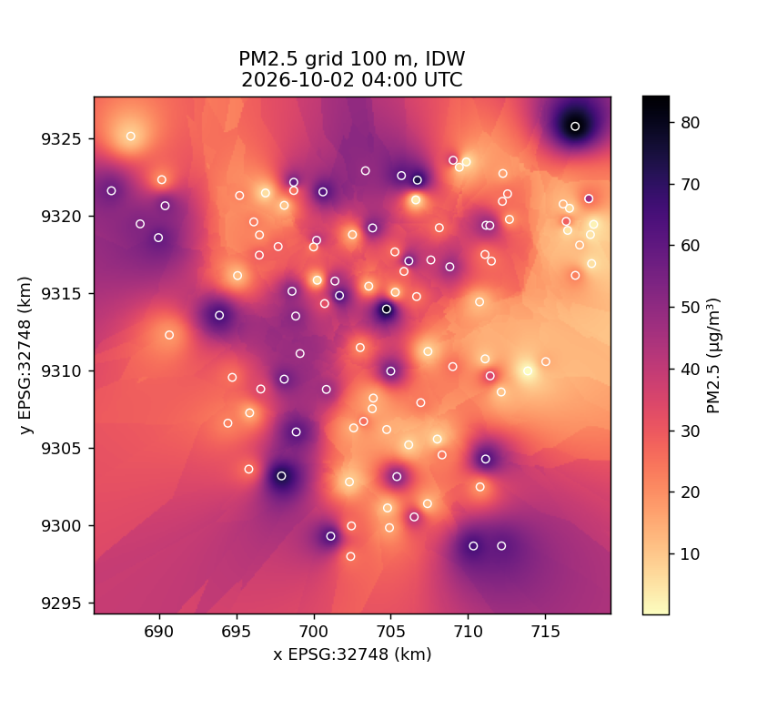
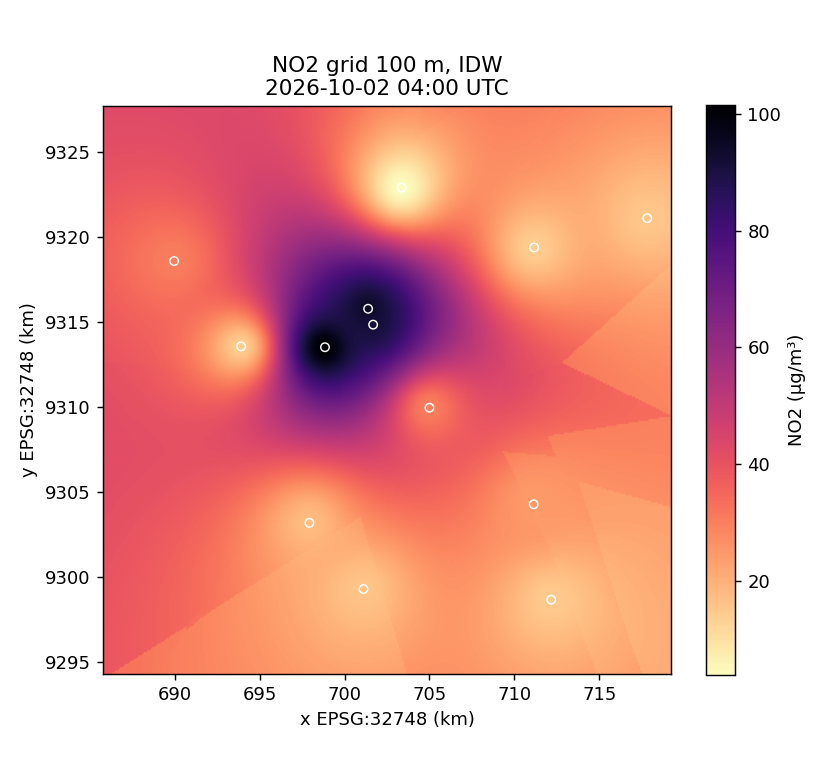

# Baseline IDW Spatial Downscaling Model: 20261006T093030Z-idw-sh-a7e5db9bb33f-f6f15b8f

Dibangkitkan otomatis oleh `python -m spatial_model.baseline run`. Rujukan: Dokumen Desain subbab 4.3–4.4, Tabel 3.8, isu TI-AI-04.

## Ringkasan eksperimen

- Dataset: `sh-a7e5db9bb33f` (manifest SHA-256 `38114ae58283191a…`)
- Sumber ground truth: postgres, snapshot 2026-10-06T07:53:36+00:00
- Split dilaporkan: **test** [2026-10-02T00:00:00+00:00, 2026-10-06T00:00:00+00:00)
- Skema: leave-one-station-out; model IDW power = 2, neighbors = 8, jarak pada EPSG:32748
- Seed: 42; commit `c2c8954a8a`

## Metrik utama (split uji, IDW konfigurasi Tabel 3.8)

Agregat *pooled* atas seluruh stasiun-jam. Kolom `RMSE stasiun` dan `R² stasiun` adalah median metrik per stasiun (median dipakai karena R² stasiun dengan variasi sangat kecil bernilai negatif ekstrem).

| polutan | n | stasiun | time window | MAE | RMSE | R² | bias | ȳ | RMSE stasiun | R² stasiun |
|---|---|---|---|---|---|---|---|---|---|---|
| NO2 | 1185 | 13 | 96 | 34.068 | 43.068 | 0.124 | 16.371 | 50.888 | 33.794 | -2.175 |
| PM2.5 | 9903 | 108 | 96 | 19.212 | 25.224 | -0.054 | -0.773 | 32.941 | 19.743 | -2.576 |

Definisi dan satuan metrik:

- `n`: jumlah pasangan pengamatan-estimasi (stasiun-jam)
- `mae`: MAE = (1/n) Σ |ŷ − y|, µg/m³
- `rmse`: RMSE = sqrt((1/n) Σ (ŷ − y)²), µg/m³
- `r2`: R² = 1 − Σ(y − ŷ)² / Σ(y − ȳ)², tanpa satuan; dapat negatif bila lebih buruk dari ȳ
- `bias`: bias = (1/n) Σ (ŷ − y), µg/m³; positif berarti estimasi terlalu tinggi
- `mean_obs`: ȳ, rerata ground truth, µg/m³
- `nrmse`: RMSE / ȳ, tanpa satuan

R² per stasiun dihitung dari deret waktu stasiun tersebut (variasi temporal), sedangkan R² pooled juga memuat variasi antarstasiun.

## Inferensi grid (run_idw_fallback)

Contoh time window 2026-10-02T04:00:00+00:00: 111556 sel 100 m pada EPSG:32748 yang menutup JAKARTA_BBOX, 0.31 s. Grid belum memakai masker daratan, sehingga sel laut di utara ikut diestimasi; median jarak sel ke stasiun terdekat 1.7 km, maksimum 13.6 km.

## Varian evaluasi

| varian | polutan | n | stasiun | MAE | RMSE | R² | bias |
|---|---|---|---|---|---|---|---|
| no2_reference_only | NO2 | 672 | 7 | 34.356 | 44.910 | -0.487 | 8.233 |

## Analisis sensitivitas (split validasi)

Konfigurasi terbaik pada validasi, lalu dievaluasi pada split uji sebagai pembanding. Hasil utama tetap konfigurasi Tabel 3.8 agar sama dengan fallback.

| polutan | power | neighbors | RMSE val | RMSE uji | MAE uji | R² uji |
|---|---|---|---|---|---|---|
| NO2 | 2.000 | semua | 47.888 | 41.301 | 32.293 | 0.195 |
| PM2.5 | 1.000 | semua | 24.915 | 23.915 | 18.902 | 0.052 |

## Temuan: area dan keadaan dengan galat besar atau data terbatas

- NO2: RMSE 43.07 µg/m³, MAE 34.07 µg/m³, R² 0.124, bias +16.37 µg/m³ pada n = 1185 stasiun-jam dari 13 stasiun.
- NO2: 1 stasiun dengan RMSE > 1.5× agregat: DKI5 Kebun Jeruk (RMSE 75.5, bias +71.0, stasiun terdekat 4.9 km).
- NO2: galat besar menurut jarak ke stasiun sumber terdekat (km): [3, 5) (RMSE 72.4, n 139).
- NO2: data pendukung terbatas, hanya 13 stasiun dengan median jarak ke stasiun lain terdekat 5.7 km.
- PM2.5: RMSE 25.22 µg/m³, MAE 19.21 µg/m³, R² -0.054, bias -0.77 µg/m³ pada n = 9903 stasiun-jam dari 108 stasiun.
- PM2.5: 13 stasiun dengan RMSE > 1.5× agregat: LCS-26 SDN 5 Marunda (RMSE 74.0, bias -65.5, stasiun terdekat 4.8 km), DKI_PM25_65 RPTRA Amir Hamzah (RMSE 60.3, bias -58.1, stasiun terdekat 1.2 km), DKJ37 Taman Sungai Kendal (RMSE 54.8, bias -52.7, stasiun terdekat 0.0 km), DKI98 Sungai Taman Kendal (RMSE 54.8, bias +52.7, stasiun terdekat 0.0 km), DKI_PM25_23 SDN 12 Sunter Agung (RMSE 52.1, bias +50.9, stasiun terdekat 1.3 km), DKI_PM25_47 SDN 12 Gedong (RMSE 49.6, bias -47.0, stasiun terdekat 2.1 km), DKI_PM25_21 RSUD Tanjung Priok (ROOFTOP) (RMSE 45.1, bias -42.8, stasiun terdekat 0.6 km), DKI_MANGGALABISMA RPTRA Manggala Bisma, Papanggo (RMSE 42.0, bias -38.2, stasiun terdekat 1.1 km).
- PM2.5: galat besar menurut jarak ke stasiun sumber terdekat (km): [3, 5) (RMSE 38.4, n 370).
- PM2.5: DKJ37 (Reference) dan DKI98 (Reference) berjarak 1 m; pada LOSO masing-masing diestimasi hampir seluruhnya dari yang lain, sehingga RMSE 54.8 dan 54.8 µg/m³ mencerminkan selisih antarinstrumen (bias -52.7 / +52.7), bukan galat interpolasi.
- Varian no2_reference_only (no2): RMSE 44.91 µg/m³, MAE 34.36 µg/m³, R² -0.487, bias +8.23 µg/m³ pada n = 672 dari 7 stasiun.

## Galat per stasiun (10 terbesar per polutan)

### NO2

| kode | name | type | kota | n | rmse | mae | bias | r2 | nearest_station_km | high_error | limited_data |
|---|---|---|---|---|---|---|---|---|---|---|---|
| DKI5 | Kebun Jeruk | Reference | KOTA ADM. JAKARTA BARAT | 96 | 75.52 | 71.05 | 71.05 | -986.77 | 4.94 | ya |  |
| DKI1 | Bundaran HI | Reference | KOTA ADM. JAKARTA PUSAT | 96 | 60.77 | 49.11 | -13.87 | -3.31 | 0.98 |  |  |
| LCS-24 | Stasiun Palmerah | Sensor | KOTA ADM. JAKARTA SELATAN | 67 | 60.51 | 56.67 | -56.67 | -1.97 | 3.13 |  |  |
| DKJ32 | Ancol | Sensor | KOTA ADM. JAKARTA UTARA | 96 | 60.09 | 54.88 | 54.88 | -8.62 | 7.40 |  |  |
| LCS-23 | CWB Lab Klinik | Sensor | KOTA ADM. JAKARTA SELATAN | 62 | 47.54 | 40.86 | -29.54 | 0.14 | 0.98 |  |  |
| DKJ36 | Tebet Eco Park | Reference | KOTA ADM. JAKARTA SELATAN | 96 | 38.24 | 31.38 | 24.90 | -2.62 | 5.91 |  |  |
| DKI2 | Kelapa Gading | Reference | KOTA ADM. JAKARTA UTARA | 96 | 33.79 | 29.73 | 15.87 | -0.01 | 6.87 |  |  |
| DKJ35 | Rusunawa Pesakih | Sensor | KOTA ADM. JAKARTA BARAT | 96 | 32.00 | 26.14 | 21.64 | -2.18 | 6.39 |  |  |
| DKJ33 | Lebak Bulus | Sensor | KOTA ADM. JAKARTA SELATAN | 96 | 26.01 | 24.33 | 22.21 | -2.89 | 5.03 |  |  |
| DKJ37 | Taman Sungai Kendal | Reference | KOTA ADM. JAKARTA UTARA | 96 | 22.99 | 20.21 | 20.11 | -1.17 | 6.87 |  |  |

### PM2.5

| kode | name | type | kota | n | rmse | mae | bias | r2 | nearest_station_km | high_error | limited_data |
|---|---|---|---|---|---|---|---|---|---|---|---|
| LCS-26 | SDN 5 Marunda | Sensor | KOTA ADM. JAKARTA UTARA | 74 | 73.99 | 65.54 | -65.54 | -3.06 | 4.76 | ya |  |
| DKI_PM25_65 | RPTRA Amir Hamzah | Sensor | KOTA ADM. JAKARTA PUSAT | 96 | 60.30 | 58.13 | -58.13 | -8.07 | 1.23 | ya |  |
| DKJ37 | Taman Sungai Kendal | Reference | KOTA ADM. JAKARTA UTARA | 96 | 54.77 | 52.74 | -52.74 | -8.86 | 0.00 | ya |  |
| DKI98 | Sungai Taman Kendal | Reference | KOTA ADM. JAKARTA TIMUR | 96 | 54.77 | 52.74 | 52.74 | -342.74 | 0.00 | ya |  |
| DKI_PM25_23 | SDN 12 Sunter Agung | Sensor | KOTA ADM. JAKARTA UTARA | 96 | 52.11 | 50.87 | 50.87 | -1241.58 | 1.28 | ya |  |
| DKI_PM25_47 | SDN 12 Gedong | Sensor | KOTA ADM. JAKARTA TIMUR | 96 | 49.61 | 46.97 | -46.97 | -4.96 | 2.12 | ya |  |
| DKI_PM25_21 | RSUD Tanjung Priok (ROOFTOP) | Sensor | KOTA ADM. JAKARTA UTARA | 96 | 45.14 | 42.82 | -42.82 | -5.31 | 0.60 | ya |  |
| DKI_MANGGALABISMA | RPTRA Manggala Bisma, Papanggo | Sensor | KOTA ADM. JAKARTA UTARA | 96 | 41.98 | 38.25 | -38.25 | -3.64 | 1.07 | ya |  |
| DKI5 | Kebun Jeruk | Reference | KOTA ADM. JAKARTA BARAT | 96 | 41.46 | 36.28 | -36.28 | -2.68 | 2.82 | ya |  |
| LCS-04 | Jl. Fatmawati | Sensor | KOTA ADM. JAKARTA SELATAN | 73 | 40.64 | 33.89 | -33.89 | -0.99 | 3.00 | ya |  |

## Galat menurut wilayah dan waktu

### by_kota

| pollutant | kota | n | rmse | mae | bias | r2 | rmse_ratio | high_error | limited_data |
|---|---|---|---|---|---|---|---|---|---|
| no2 | KOTA ADM. JAKARTA BARAT | 192 | 58.00 | 48.59 | 46.34 | -11.47 | 1.35 |  |  |
| no2 | KOTA ADM. JAKARTA PUSAT | 96 | 60.77 | 49.11 | -13.87 | -3.31 | 1.41 |  |  |
| no2 | KOTA ADM. JAKARTA SELATAN | 417 | 38.37 | 31.04 | -0.23 | 0.51 | 0.89 |  |  |
| no2 | KOTA ADM. JAKARTA TIMUR | 192 | 19.97 | 17.29 | 16.69 | -1.13 | 0.46 |  |  |
| no2 | KOTA ADM. JAKARTA UTARA | 288 | 41.96 | 34.94 | 30.29 | -1.76 | 0.97 |  |  |
| pm25 | KOTA ADM. JAKARTA BARAT | 1588 | 24.82 | 19.64 | 0.72 | 0.12 | 0.98 |  |  |
| pm25 | KOTA ADM. JAKARTA PUSAT | 1073 | 32.21 | 28.06 | -1.39 | -0.62 | 1.28 |  |  |
| pm25 | KOTA ADM. JAKARTA SELATAN | 2063 | 20.09 | 15.19 | -2.38 | 0.20 | 0.80 |  |  |
| pm25 | KOTA ADM. JAKARTA TIMUR | 2653 | 23.31 | 18.08 | 0.83 | -0.08 | 0.92 |  |  |
| pm25 | KOTA ADM. JAKARTA UTARA | 2526 | 27.68 | 19.66 | -1.81 | -0.19 | 1.10 |  |  |

### by_station_type

| pollutant | type | n | rmse | mae | bias | r2 | rmse_ratio | high_error | limited_data |
|---|---|---|---|---|---|---|---|---|---|
| no2 | Reference | 672 | 43.45 | 33.31 | 20.94 | -0.39 | 1.01 |  |  |
| no2 | Sensor | 513 | 42.57 | 35.06 | 10.39 | 0.41 | 0.99 |  |  |
| pm25 | Reference | 1526 | 29.75 | 22.46 | -9.80 | -0.20 | 1.18 |  |  |
| pm25 | Sensor | 8377 | 24.31 | 18.62 | 0.87 | -0.02 | 0.96 |  |  |

### by_suspected_low_bias

| pollutant | suspected_low_bias | n | rmse | mae | bias | r2 | rmse_ratio | high_error | limited_data |
|---|---|---|---|---|---|---|---|---|---|
| no2 |  | 1185 | 43.07 | 34.07 | 16.37 | 0.12 | 1.00 |  |  |
| pm25 |  | 9327 | 24.65 | 18.58 | -2.64 | -0.02 | 0.98 |  |  |
| pm25 | ya | 576 | 33.12 | 29.46 | 29.46 | -110.60 | 1.31 |  |  |

### by_day_type

| pollutant | day_type | n | rmse | mae | bias | r2 | rmse_ratio | high_error | limited_data |
|---|---|---|---|---|---|---|---|---|---|
| no2 | akhir pekan | 620 | 41.38 | 34.16 | 18.48 | 0.14 | 0.96 |  |  |
| no2 | hari kerja | 565 | 44.85 | 33.97 | 14.06 | 0.11 | 1.04 |  |  |
| pm25 | akhir pekan | 5053 | 25.26 | 19.27 | -0.73 | -0.02 | 1.00 |  |  |
| pm25 | hari kerja | 4850 | 25.19 | 19.15 | -0.81 | -0.10 | 1.00 |  |  |

### by_nearest_source_km

| pollutant | nearest_source_km_bin | n | rmse | mae | bias | r2 | rmse_ratio | high_error | limited_data |
|---|---|---|---|---|---|---|---|---|---|
| no2 | [0, 1) | 124 | 43.69 | 37.25 | -4.30 | 0.01 | 1.01 |  |  |
| no2 | [3, 5) | 139 | 72.38 | 67.39 | 11.07 | -0.05 | 1.68 | ya |  |
| no2 | [5, 10) | 922 | 36.57 | 28.62 | 19.95 | -0.90 | 0.85 |  |  |
| pm25 | [0, 1) | 2810 | 23.14 | 16.17 | -0.55 | -0.26 | 0.92 |  |  |
| pm25 | [1, 2) | 5348 | 24.33 | 19.34 | 1.35 | 0.01 | 0.96 |  |  |
| pm25 | [2, 3) | 1375 | 28.11 | 22.65 | -8.98 | -0.22 | 1.11 |  |  |
| pm25 | [3, 5) | 370 | 38.41 | 27.78 | -2.59 | -0.34 | 1.52 | ya |  |

### by_sources_available

| pollutant | sources_available_bin | n | rmse | mae | bias | r2 | rmse_ratio | high_error | limited_data |
|---|---|---|---|---|---|---|---|---|---|
| no2 | [10, 25) | 1185 | 43.07 | 34.07 | 16.37 | 0.12 | 1.00 |  |  |
| pm25 | [100, 1000) | 7813 | 25.33 | 19.31 | -0.76 | -0.03 | 1.00 |  |  |
| pm25 | [75, 100) | 2090 | 24.83 | 18.83 | -0.83 | -0.20 | 0.98 |  |  |

### by_reference_fraction_used

| pollutant | reference_fraction_bin | n | rmse | mae | bias | r2 | rmse_ratio | high_error | limited_data |
|---|---|---|---|---|---|---|---|---|---|
| no2 | (0,25, 0,5] | 511 | 46.39 | 37.60 | 13.63 | 0.33 | 1.08 |  |  |
| no2 | (0,5, 1] | 674 | 40.37 | 31.39 | 18.45 | -0.65 | 0.94 |  |  |
| pm25 | (0, 0,25] | 4553 | 23.03 | 17.82 | 4.23 | -0.05 | 0.91 |  |  |
| pm25 | (0,25, 0,5] | 44 | 9.47 | 7.58 | 5.68 | -2.51 | 0.38 |  |  |
| pm25 | (0,5, 1] | 1130 | 31.42 | 21.07 | -3.29 | -0.42 | 1.25 |  |  |
| pm25 | 0 | 4176 | 25.73 | 20.35 | -5.61 | -0.06 | 1.02 |  |  |

## Visualisasi

## Berkas

- `run_manifest.json`: konfigurasi, seed, versi dataset/kode/pustaka, perangkat keras, durasi
- `config.toml`: salinan konfigurasi yang dipakai
- `metrics.json`: metrik agregat, per stasiun, dan hasil sensitivitas
- `tables/*.csv`: seluruh tabel analisis galat
- `predictions.parquet`: estimasi LOSO per stasiun-jam (tidak di-commit)
