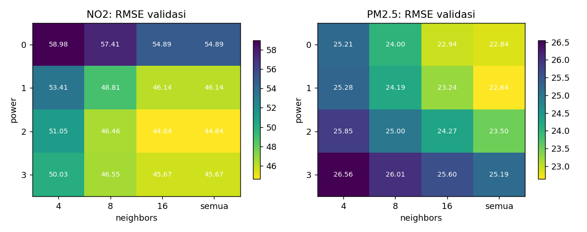
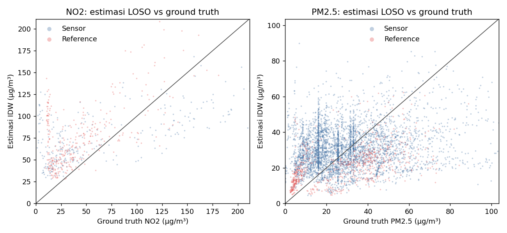
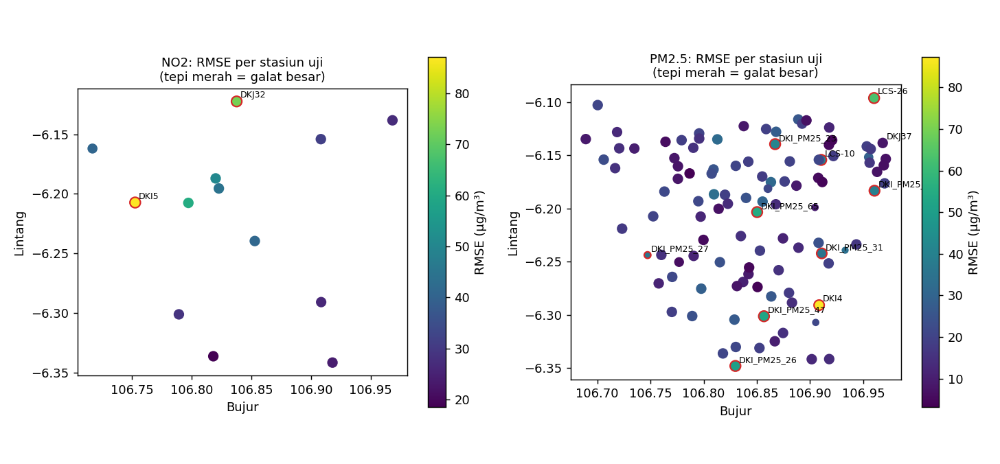
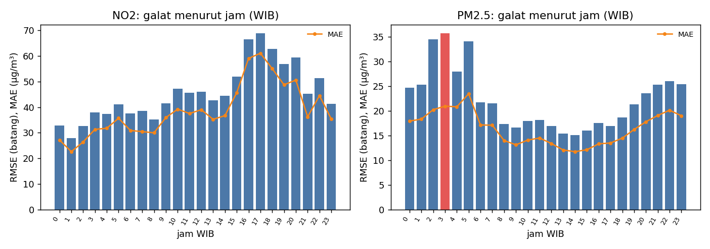
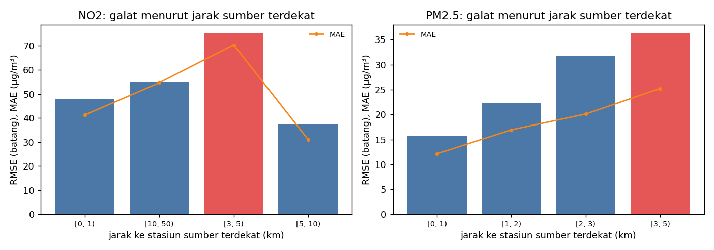
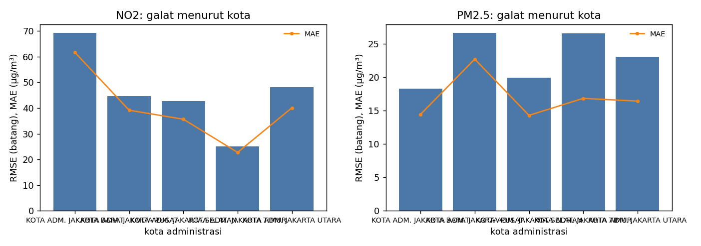
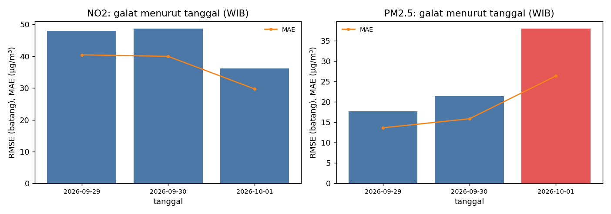
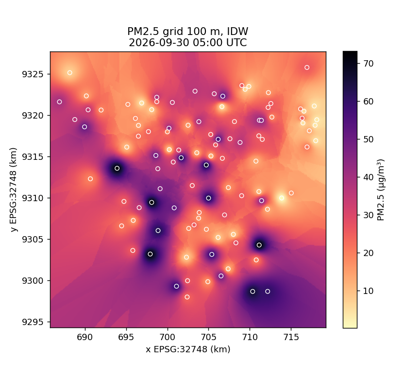
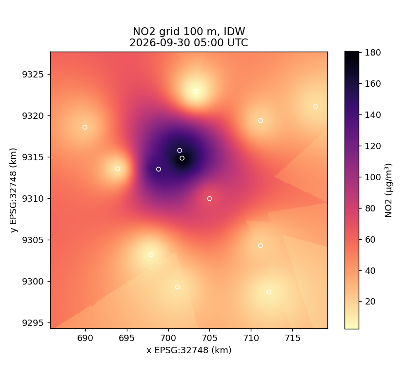

# Baseline IDW Spatial Downscaling Model: 20261010T133746Z-idw-ds-v0.1.0-f6f15b8f

Dibangkitkan otomatis oleh `python -m spatial_model.baseline run`. Rujukan: Dokumen Desain subbab 4.3–4.4, Tabel 3.8, isu TI-AI-04.

## Ringkasan eksperimen

- Dataset: `ds-v0.1.0` (manifest SHA-256 `f094a4b061c0c26e…`)
- Sumber ground truth: snapshot, snapshot 2026-10-06T06:22:15.075236+00:00
- Split dilaporkan: **test** [2026-09-29T00:00:00Z, 2026-09-30T23:00:00Z)
- Skema: leave-one-group-out; model IDW power = 2, neighbors = 8, jarak pada EPSG:32748
- Seed: 42; commit `923cfdd270`

## Metrik utama (split uji, IDW konfigurasi Tabel 3.8)

Agregat *pooled* atas seluruh stasiun-jam. Kolom `RMSE stasiun` dan `R² stasiun` adalah median metrik per stasiun (median dipakai karena R² stasiun dengan variasi sangat kecil bernilai negatif ekstrem).

| polutan | n | stasiun | time window | MAE | RMSE | R² | bias | ȳ | RMSE stasiun | R² stasiun |
|---|---|---|---|---|---|---|---|---|---|---|
| NO2 | 604 | 13 | 47 | 38.812 | 46.992 | 0.141 | 22.102 | 54.652 | 40.841 | -2.029 |
| PM2.5 | 4905 | 109 | 47 | 16.421 | 23.063 | -0.061 | -1.295 | 30.936 | 18.111 | -1.850 |

Definisi dan satuan metrik:

- `n`: jumlah pasangan pengamatan-estimasi (stasiun-jam)
- `mae`: MAE = (1/n) Σ |ŷ − y|, µg/m³
- `rmse`: RMSE = sqrt((1/n) Σ (ŷ − y)²), µg/m³
- `r2`: R² = 1 − Σ(y − ŷ)² / Σ(y − ȳ)², tanpa satuan; dapat negatif bila lebih buruk dari ȳ
- `bias`: bias = (1/n) Σ (ŷ − y), µg/m³; positif berarti estimasi terlalu tinggi
- `mean_obs`: ȳ, rerata ground truth, µg/m³
- `nrmse`: RMSE / ȳ, tanpa satuan

R² per stasiun dihitung dari deret waktu stasiun tersebut (variasi temporal), sedangkan R² pooled juga memuat variasi antarstasiun.

## Inferensi grid (run_idw_fallback)

Contoh time window 2026-09-30T05:00:00+00:00: 111556 sel 100 m pada EPSG:32748 yang menutup JAKARTA_BBOX, 0.3 s. Grid belum memakai masker daratan, sehingga sel laut di utara ikut diestimasi; median jarak sel ke stasiun terdekat 1.7 km, maksimum 13.6 km.

## Varian evaluasi

| varian | polutan | n | stasiun | MAE | RMSE | R² | bias |
|---|---|---|---|---|---|---|---|
| no2_reference_only | NO2 | 328 | 7 | 32.921 | 43.411 | -0.447 | 8.218 |

## Split tetap blind ganda

Estimasi di stasiun uji pada blok uji hanya dari stasiun train (stasiun validasi dan uji tidak menjadi sumber).

| polutan | n | stasiun uji | MAE | RMSE | R² | bias |
|---|---|---|---|---|---|---|
| PM2.5 | 756 | 17 | 11.992 | 16.012 | 0.022 | 3.835 |
## Analisis sensitivitas (split validasi)

Konfigurasi terbaik pada validasi, lalu dievaluasi pada split uji sebagai pembanding. Hasil utama tetap konfigurasi Tabel 3.8 agar sama dengan fallback.

| polutan | power | neighbors | RMSE val | RMSE uji | MAE uji | R² uji |
|---|---|---|---|---|---|---|
| NO2 | 2.000 | semua | 44.645 | 44.660 | 36.435 | 0.224 |
| PM2.5 | 1.000 | semua | 22.637 | 21.368 | 15.366 | 0.089 |

## Temuan: area dan keadaan dengan galat besar atau data terbatas

- NO2: RMSE 46.99 µg/m³, MAE 38.81 µg/m³, R² 0.141, bias +22.10 µg/m³ pada n = 604 stasiun-jam dari 13 stasiun.
- NO2: 2 stasiun dengan RMSE > 1.5× agregat: DKI5 Kebun Jeruk (RMSE 87.1, bias +84.7, stasiun terdekat 4.9 km), DKJ32 Ancol (RMSE 72.7, bias +67.7, stasiun terdekat 7.4 km).
- NO2: galat besar menurut jarak ke stasiun sumber terdekat (km): [3, 5) (RMSE 75.1, n 94).
- NO2: data pendukung terbatas, hanya 13 stasiun dengan median jarak ke stasiun lain terdekat 5.7 km.
- PM2.5: RMSE 23.06 µg/m³, MAE 16.42 µg/m³, R² -0.061, bias -1.29 µg/m³ pada n = 4905 stasiun-jam dari 109 stasiun.
- PM2.5: 11 stasiun dengan RMSE > 1.5× agregat: DKI4 Lubang Buaya (RMSE 87.3, bias -46.3, stasiun terdekat 1.8 km), LCS-26 SDN 5 Marunda (RMSE 63.2, bias -51.7, stasiun terdekat 4.8 km), DKI_PM25_65 RPTRA Amir Hamzah (RMSE 54.5, bias -52.8, stasiun terdekat 1.2 km), DKI_PM25_47 SDN 12 Gedong (RMSE 52.5, bias -49.8, stasiun terdekat 2.2 km), DKI_PM25_26 Asrama Universitas Indonesia (RMSE 50.2, bias -24.7, stasiun terdekat 1.8 km), DKJ37 Taman Sungai Kendal (RMSE 44.8, bias -44.5, stasiun terdekat 0.0 km), DKI_PM25_23 SDN 12 Sunter Agung (RMSE 41.5, bias +39.0, stasiun terdekat 1.3 km), DKI_PM25_18 SDN 02 Pagi Ujung Menteng (RMSE 39.5, bias -29.1, stasiun terdekat 1.3 km).
- PM2.5: 5 stasiun memiliki pengamatan kurang dari 24 stasiun-jam pada split ini: DKJ37, DKI_PM25_27, DKI_PM25_87, DKI_PM25_57, DKI_PM25_24.
- PM2.5: galat besar menurut jam WIB: 3 (RMSE 35.7, n 207).
- PM2.5: galat besar menurut jarak ke stasiun sumber terdekat (km): [3, 5) (RMSE 36.2, n 172).
- PM2.5: DKJ37 (Reference) dan DKI98 (Reference) berjarak 1 m dan satu grup, sehingga ditahan bersama pada LOSO per grup; RMSE 44.8 dan 8.3 µg/m³ (bias -44.5 / +8.1) berasal dari stasiun sumber lain.
- Varian no2_reference_only (no2): RMSE 43.41 µg/m³, MAE 32.92 µg/m³, R² -0.447, bias +8.22 µg/m³ pada n = 328 dari 7 stasiun.
- Split tetap blind ganda (pm25): RMSE 16.01 µg/m³, MAE 11.99 µg/m³, R² 0.022, bias +3.84 µg/m³ pada n = 756 dari 17 stasiun uji.

## Galat per stasiun (10 terbesar per polutan)

### NO2

| kode | name | type | kota | n | rmse | mae | bias | r2 | nearest_station_km | high_error | limited_data |
|---|---|---|---|---|---|---|---|---|---|---|---|
| DKI5 | Kebun Jeruk | Reference | KOTA ADM. JAKARTA BARAT | 47 | 87.06 | 84.67 | 84.67 | -6806.11 | 4.94 | ya |  |
| DKJ32 | Ancol | Sensor | KOTA ADM. JAKARTA UTARA | 46 | 72.67 | 67.67 | 67.67 | -14.15 | 7.40 | ya |  |
| LCS-24 | Stasiun Palmerah | Sensor | KOTA ADM. JAKARTA SELATAN | 47 | 60.75 | 56.13 | -56.13 | -1.95 | 3.13 |  |  |
| LCS-23 | CWB Lab Klinik | Sensor | KOTA ADM. JAKARTA SELATAN | 47 | 50.60 | 43.40 | -30.38 | -0.31 | 0.98 |  |  |
| DKI1 | Bundaran HI | Reference | KOTA ADM. JAKARTA PUSAT | 47 | 44.72 | 39.17 | 21.72 | -1.05 | 0.98 |  |  |
| DKJ36 | Tebet Eco Park | Reference | KOTA ADM. JAKARTA SELATAN | 47 | 41.55 | 35.77 | 34.72 | -2.49 | 5.91 |  |  |
| DKJ35 | Rusunawa Pesakih | Sensor | KOTA ADM. JAKARTA BARAT | 42 | 40.84 | 35.99 | 35.99 | -5.68 | 6.39 |  |  |
| DKI2 | Kelapa Gading | Reference | KOTA ADM. JAKARTA UTARA | 47 | 31.44 | 27.95 | 19.83 | -0.14 | 6.87 |  |  |
| DKJ33 | Lebak Bulus | Sensor | KOTA ADM. JAKARTA SELATAN | 47 | 29.02 | 27.13 | 27.13 | -3.77 | 5.03 |  |  |
| DKJ37 | Taman Sungai Kendal | Reference | KOTA ADM. JAKARTA UTARA | 47 | 27.04 | 25.25 | 25.25 | -2.03 | 6.87 |  |  |

### PM2.5

| kode | name | type | kota | n | rmse | mae | bias | r2 | nearest_station_km | high_error | limited_data |
|---|---|---|---|---|---|---|---|---|---|---|---|
| DKI4 | Lubang Buaya | Reference | KOTA ADM. JAKARTA TIMUR | 44 | 87.28 | 46.32 | -46.32 | -0.26 | 1.84 | ya |  |
| LCS-26 | SDN 5 Marunda | Sensor | KOTA ADM. JAKARTA UTARA | 47 | 63.22 | 51.68 | -51.68 | -1.59 | 4.76 | ya |  |
| DKI_PM25_65 | RPTRA Amir Hamzah | Sensor | KOTA ADM. JAKARTA PUSAT | 47 | 54.52 | 52.79 | -52.79 | -10.90 | 1.23 | ya |  |
| DKI_PM25_47 | SDN 12 Gedong | Sensor | KOTA ADM. JAKARTA TIMUR | 47 | 52.51 | 49.75 | -49.75 | -5.62 | 2.20 | ya |  |
| DKI_PM25_26 | Asrama Universitas Indonesia | Sensor | KOTA ADM. JAKARTA SELATAN | 47 | 50.18 | 32.25 | -24.68 | -0.29 | 1.84 | ya |  |
| DKJ37 | Taman Sungai Kendal | Reference | KOTA ADM. JAKARTA UTARA | 3 | 44.75 | 44.48 | -44.48 | -18.71 | 0.00 | ya | ya |
| DKI_PM25_23 | SDN 12 Sunter Agung | Sensor | KOTA ADM. JAKARTA UTARA | 47 | 41.49 | 39.03 | 39.03 | -1915.84 | 1.28 | ya |  |
| DKI_PM25_18 | SDN 02 Pagi Ujung Menteng | Sensor | KOTA ADM. JAKARTA TIMUR | 46 | 39.47 | 29.13 | -29.13 | -1.03 | 1.30 | ya |  |
| LCS-10 | SPKU Kelapa Gading | Sensor | KOTA ADM. JAKARTA UTARA | 47 | 39.11 | 34.75 | -34.75 | -4.59 | 0.24 | ya |  |
| DKI_PM25_27 | RPTRA Manunggal Petukangan Selatan | Sensor | KOTA ADM. JAKARTA SELATAN | 13 | 36.37 | 32.31 | -31.78 | -2.57 | 1.44 | ya | ya |

## Galat menurut wilayah dan waktu

### by_kota

| pollutant | kota | n | rmse | mae | bias | r2 | rmse_ratio | high_error | limited_data |
|---|---|---|---|---|---|---|---|---|---|
| no2 | KOTA ADM. JAKARTA BARAT | 89 | 69.21 | 61.70 | 61.70 | -25.48 | 1.47 |  |  |
| no2 | KOTA ADM. JAKARTA PUSAT | 47 | 44.72 | 39.17 | 21.72 | -1.05 | 0.95 |  |  |
| no2 | KOTA ADM. JAKARTA SELATAN | 235 | 42.81 | 35.66 | -2.05 | 0.48 | 0.91 |  |  |
| no2 | KOTA ADM. JAKARTA TIMUR | 93 | 25.18 | 22.76 | 22.44 | -2.45 | 0.54 |  |  |
| no2 | KOTA ADM. JAKARTA UTARA | 140 | 48.09 | 40.09 | 37.37 | -3.04 | 1.02 |  |  |
| pm25 | KOTA ADM. JAKARTA BARAT | 842 | 18.28 | 14.45 | 1.31 | 0.10 | 0.79 |  |  |
| pm25 | KOTA ADM. JAKARTA PUSAT | 547 | 26.62 | 22.72 | -0.45 | -0.75 | 1.15 |  |  |
| pm25 | KOTA ADM. JAKARTA SELATAN | 1087 | 19.94 | 14.30 | -2.27 | 0.05 | 0.86 |  |  |
| pm25 | KOTA ADM. JAKARTA TIMUR | 1220 | 26.61 | 16.84 | -1.66 | 0.01 | 1.15 |  |  |
| pm25 | KOTA ADM. JAKARTA UTARA | 1209 | 23.08 | 16.43 | -2.25 | -0.17 | 1.00 |  |  |

### by_station_type

| pollutant | type | n | rmse | mae | bias | r2 | rmse_ratio | high_error | limited_data |
|---|---|---|---|---|---|---|---|---|---|
| no2 | Reference | 328 | 44.87 | 36.14 | 32.11 | -0.55 | 0.95 |  |  |
| no2 | Sensor | 276 | 49.39 | 41.99 | 10.20 | 0.36 | 1.05 |  |  |
| pm25 | Reference | 694 | 27.66 | 16.32 | -8.46 | 0.10 | 1.20 |  |  |
| pm25 | Sensor | 4211 | 22.21 | 16.44 | -0.11 | -0.11 | 0.96 |  |  |

### by_suspected_low_bias

| pollutant | suspected_low_bias | n | rmse | mae | bias | r2 | rmse_ratio | high_error | limited_data |
|---|---|---|---|---|---|---|---|---|---|
| no2 |  | 604 | 46.99 | 38.81 | 22.10 | 0.14 | 1.00 |  |  |
| pm25 |  | 4623 | 22.74 | 15.90 | -2.90 | -0.05 | 0.99 |  |  |
| pm25 | ya | 282 | 27.83 | 24.96 | 24.96 | -90.69 | 1.21 |  |  |

### by_day_type

| pollutant | day_type | n | rmse | mae | bias | r2 | rmse_ratio | high_error | limited_data |
|---|---|---|---|---|---|---|---|---|---|
| no2 | hari kerja | 604 | 46.99 | 38.81 | 22.10 | 0.14 | 1.00 |  |  |
| pm25 | hari kerja | 4905 | 23.06 | 16.42 | -1.29 | -0.06 | 1.00 |  |  |

### by_nearest_source_km

| pollutant | nearest_source_km_bin | n | rmse | mae | bias | r2 | rmse_ratio | high_error | limited_data |
|---|---|---|---|---|---|---|---|---|---|
| no2 | [0, 1) | 94 | 47.75 | 41.29 | -4.33 | -0.37 | 1.02 |  |  |
| no2 | [10, 50) | 1 | 54.66 | 54.66 | 54.66 |  | 1.16 |  | ya |
| no2 | [3, 5) | 94 | 75.07 | 70.40 | 14.27 | -0.08 | 1.60 | ya |  |
| no2 | [5, 10) | 415 | 37.60 | 31.06 | 29.78 | -2.27 | 0.80 |  |  |
| pm25 | [0, 1) | 1254 | 15.66 | 12.12 | -1.06 | -0.13 | 0.68 |  |  |
| pm25 | [1, 2) | 2817 | 22.39 | 16.93 | 0.39 | -0.07 | 0.97 |  |  |
| pm25 | [2, 3) | 662 | 31.65 | 20.10 | -8.01 | -0.16 | 1.37 |  |  |
| pm25 | [3, 5) | 172 | 36.22 | 25.25 | -4.78 | -0.28 | 1.57 | ya |  |

### by_sources_available

| pollutant | sources_available_bin | n | rmse | mae | bias | r2 | rmse_ratio | high_error | limited_data |
|---|---|---|---|---|---|---|---|---|---|
| no2 | [10, 25) | 604 | 46.99 | 38.81 | 22.10 | 0.14 | 1.00 |  |  |
| pm25 | [100, 1000) | 4810 | 23.06 | 16.38 | -1.29 | -0.06 | 1.00 |  |  |
| pm25 | [75, 100) | 95 | 23.00 | 18.45 | -1.67 | -0.10 | 1.00 |  |  |

### by_reference_fraction_used

| pollutant | reference_fraction_bin | n | rmse | mae | bias | r2 | rmse_ratio | high_error | limited_data |
|---|---|---|---|---|---|---|---|---|---|
| no2 | (0,25, 0,5] | 359 | 49.10 | 40.44 | 16.10 | 0.28 | 1.04 |  |  |
| no2 | (0,5, 1] | 245 | 43.72 | 36.42 | 30.90 | -0.79 | 0.93 |  |  |
| pm25 | (0, 0,25] | 2149 | 21.46 | 16.25 | 3.29 | -0.14 | 0.93 |  |  |
| pm25 | (0,25, 0,5] | 10 | 19.04 | 17.11 | -16.75 | -7.42 | 0.83 |  | ya |
| pm25 | (0,5, 1] | 500 | 26.92 | 18.21 | -5.36 | -0.10 | 1.17 |  |  |
| pm25 | 0 | 2246 | 23.62 | 16.19 | -4.71 | -0.05 | 1.02 |  |  |

## Visualisasi

## Berkas

- `run_manifest.json`: konfigurasi, seed, versi dataset/kode/pustaka, perangkat keras, durasi
- `config.toml`: salinan konfigurasi yang dipakai
- `metrics.json`: metrik agregat, per stasiun, dan hasil sensitivitas
- `tables/*.csv`: seluruh tabel analisis galat
- `predictions.parquet`: estimasi LOSO per stasiun-jam (tidak di-commit)
