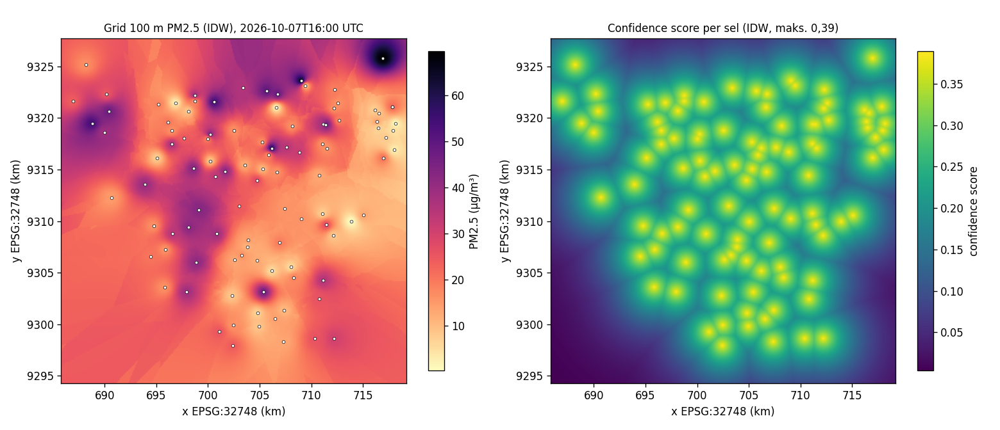
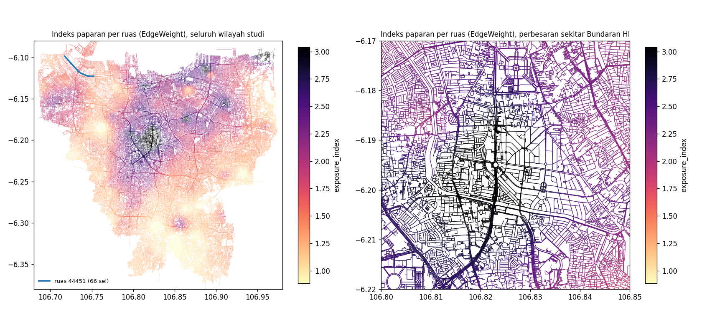

# TI-AI-05: Estimasi grid sampai EdgeWeight

Bukti verifikasi isu #16. Kode dan definisinya:
[`src/data_worker/spatial_model`](../../../src/data_worker/spatial_model/README.md).

## Cara bukti ini dibuat

- **Data masukan:** ground truth SPKU dan graf road network aktif `jakarta-20261005` (373.352 ruas),
  dibaca read-only dari PostgreSQL Railway pada 7 Oktober 2026.
- **Cache tujuan:** salinan lokal PostgreSQL 16 + PostGIS 3.4 dengan skema dari `database/models.py`
  (Tabel 3.17). Railway tidak ditulisi.
- **Yang dijalankan:** langkah siklus `trigger_downscale_inference` di `acquisition.py`, persis seperti
  cron Railway, dengan `DOWNSCALE_WRITE_CACHE=1` dan `DOWNSCALE_KEEP_WINDOWS=2`. Time window yang
  dipakai: 7 Oktober 2026 pukul 14.00, 15.00, dan 16.00 UTC.
- **Commit kode:** `e04c4aa`, working tree bersih.

| Berkas | Isi |
|---|---|
| [`run_manifest.json`](run_manifest.json) | Manifest run 16.00 UTC: versi model, alasan fallback, GridSpec, parameter IDW, hash masukan dan setiap artefak, commit |
| [`cycle_smoke.json`](cycle_smoke.json) | Hasil tiga siklus, pemanggilan ulang, flag nonaktif, dan retensi |
| [`cache_compatibility.json`](cache_compatibility.json) | Uji tulis-baca cache pada volume penuh |
| [`edge_weights_sample.csv`](edge_weights_sample.csv) | 201 contoh EdgeWeight (kolom kontrak Tabel 3.3 ditambah `n_cells` dan jarak stasiun) |
| [`grid_prediction_sample.csv`](grid_prediction_sample.csv) | 200 contoh sel grid 100 m beserta confidence score |
| [`trace_edge_44451.csv`](trace_edge_44451.csv) | Jejak satu ruas sampai sel grid sumbernya |
| [`ground_truth_input.csv`](ground_truth_input.csv) | Ground truth masukan time window 16.00 UTC setelah kendali mutu |
| [`summary_statistics.json`](summary_statistics.json) | Statistik grid, EdgeWeight, dan tabel potongan ruas-sel |

Artefak penuh per run (`grid_prediction.parquet`, `edge_cell_pieces.parquet`, `edge_weights.parquet`,
sekitar 30 MB) tidak di-commit. SHA-256 setiap berkas tercatat di `run_manifest.json`, dan seluruh artefak
dapat dibangkitkan ulang dengan `python -m spatial_model infer`.

## Contoh keluaran

**Grid 100 m (time window 7 Oktober 2026 16.00 UTC).** Masukannya 104 stasiun PM2.5 dan 11 stasiun NO2.

| | Sel | Rerata | Median | Min | Maks |
|---|---|---|---|---|---|
| PM2.5 (µg/m³) | 111.556 | 23,74 | 22,99 | 0,27 | 69,57 |
| NO2 (µg/m³) | 111.556 | 37,90 | 32,34 | 10,82 | 106,48 |
| Indeks paparan | 111.556 | 1,55 | 1,37 | 0,75 | 3,52 |
| Confidence score | 111.556 | 0,20 | 0,22 | 0,004 | 0,389 |
| Jarak ke stasiun terdekat (m) | 111.556 | 2.523 | 1.728 | 6 | 13.604 |

**EdgeWeight.** 372.069 ruas mendapat estimasi, atau 99,66% dari 373.352 ruas graf. Sisanya, 1.283 ruas,
berada di Kepulauan Seribu dan pulau-pulau Teluk Jakarta di luar grid wilayah studi. Ruas-ruas ini
dicatat di `edges_without_estimate`.

| | Ruas | Rerata | Median | Min | Maks |
|---|---|---|---|---|---|
| PM2.5 (µg/m³) | 372.069 | 23,68 | 22,40 | 0,27 | 69,57 |
| NO2 (µg/m³) | 372.069 | 45,22 | 46,02 | 10,82 | 106,48 |
| Indeks paparan | 372.069 | 1,69 | 1,60 | 0,75 | 3,52 |
| Confidence score | 372.069 | 0,27 | 0,27 | 0,05 | 0,389 |
| Sel yang dilalui | 372.069 | 1,5 | 1 | 1 | 66 |

## Definisi agregasi

Setiap ruas dipotong tepat pada batas sel grid. Nilai ruas adalah rata-rata nilai sel yang dilalui,
dibobot panjang potongan ruas di setiap sel. Indeks paparan dihitung setelah agregasi dari polutan yang
tersedia. Rinciannya ada di
[README modul](../../../src/data_worker/spatial_model/README.md#definisi-agregasi-grid-ke-ruas) dan
diuji oleh UT-SDM-07 (a)–(e).

Pada time window ini, tabel potongan memuat 574.809 pasangan ruas-sel dengan panjang total 17.317 km,
dan menyentuh 63.413 sel. Ruas yang melintasi lebih dari satu sel tertangani dengan bobot panjang.
Contohnya ruas 44451 (4,9 km) yang melintasi 66 sel: PM2.5 yang dihitung ulang dari
`trace_edge_44451.csv` adalah 25,8005 µg/m³, sama persis dengan nilai di cache.

## Metadata model dan penanda fallback

- **Model:** `model_version = idw-p2-k8` dan `estimation_source = idw`, dengan
  `fallback_reason = ModelUnavailableError: model spatial-downscaling production belum terdaftar di Model Registry`.
- **Penanda fallback:** `background_source` kosong untuk seluruh baris, karena IDW tidak memakai suku
  latar. Confidence score maksimum 0,389, sehingga seluruh ruas berkategori keyakinan rendah (< 0,4).
- **Penelusuran:** parameter IDW (power 2, 8 tetangga), hash konfigurasi baseline, GridSpec, hash ground
  truth masukan, dan versi graf tercatat di `run_manifest.json`.

## Uji kompatibilitas cache

| Pemeriksaan | Hasil |
|---|---|
| Tulis 372.069 EdgeWeight dalam satu transaksi | Berhasil; `pollution_window` berstatus `complete`, cakupan 0,9966 |
| Baca ulang seluruh wilayah studi (`read_pollution_weight`) | 372.067 baris, 2,8 s. Selisih terhadap nilai yang dihitung ≤ 7,6·10⁻⁶ (presisi `REAL`). Dua ruas tidak terbaca karena berada di dalam grid tetapi di luar bbox kueri |
| Baca bbox ±1 × 1 km (permintaan rute) | 1.178 ruas, 0,25 s pada kueri pertama |
| Tulis ulang time window yang sama | 372.069 baris, tanpa duplikat (kunci `edge_id`, `time_window_start`) |
| Tiga siklus berturut-turut | Masing-masing ±9 s; retensi menyisakan dua time window terakhir |
| Pemanggilan ulang time window yang sudah complete | `skipped`, `run_id` sama, 0 baris ditulis (UT-SDM-01b) |
| `DOWNSCALE_WRITE_CACHE` tidak diatur | Langkah berstatus `disabled` |
| Ukuran satu time window | ±92 MB termasuk indeks; dengan retensi bawaan 6 time window sekitar 0,55 GB |

Uji otomatis pada `tests/test_spatial_edgeweight.py` dan `tests/test_spatial_baseline.py`
(UT-SDM-01, 06, 07, 08; UT-OPS-01, 02; retensi; portabilitas encoding) lulus terhadap
PostgreSQL + PostGIS sungguhan: 129 lulus. Tanpa basis data: 92 lulus dan 37 dilewati.

## Pemenuhan acceptance criteria

| Kriteria | Bukti |
|---|---|
| Setiap EdgeWeight dapat ditelusuri ke versi model, input waktu, dan sel grid sumber | `model_version`, `time_window_start`, dan `graph_version` pada setiap baris cache; `run_manifest.json`; `trace_edge_44451.csv` |
| Nilai fallback dapat dibedakan dari estimasi berbasis data lengkap | `estimation_source = idw`, confidence < 0,4, `background_source` kosong, `fallback_reason` |
| Agregasi menangani ruas yang melintasi lebih dari satu sel | Pemotongan pada batas sel dengan bobot panjang; UT-SDM-07b dan 07e; ruas 44451 (66 sel) |
| Kompatibel dengan kontrak TI-SE-01 dan dapat ditulis/dibaca melalui cache | `contracts.EdgeWeight` (Tabel 3.3); tabel uji di atas; UT-OPS-01 dan 02 |

## Keterbatasan

- **ST-GNN belum ada.** Inferensi FeatureMatrix dengan ST-GNN belum dapat dijalankan karena
  FeatureMatrix dan artefak modelnya belum tersedia (TI-AI-02, TI-AI-09). Jalur ST-GNN sudah disiapkan
  dan saat ini selalu jatuh ke fallback IDW, sesuai Tabel 3.12.
- **Suku latar belum dipakai.** Suku latar berskala makro (AOD/reanalysis) belum dipakai, sehingga
  `background_source` masih kosong.
- **Confidence score provisional.** Rumusnya masih provisional sampai kalibrasi PF-12 dilakukan.
- **Kontrak TI-SE-01 belum resmi.** `EdgeWeight` mengikuti Tabel 3.3 karena TI-SE-01 belum
  menghasilkan kontrak bersama; Backend perlu memakai struktur yang sama.
- **Artefak di Railway belum persisten.** Artefak penelusuran di Railway akan hilang setiap kontainer
  berhenti sampai tersedia Railway Volume atau object storage (TI-DO-03).
